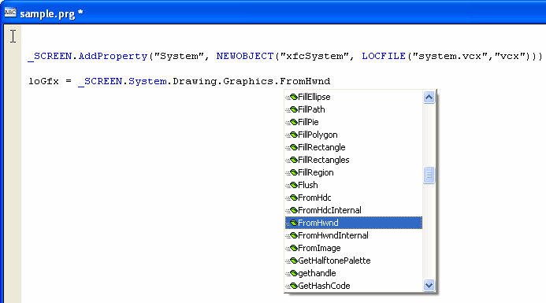

# GDIPlusX Library Reference

**BETA**

Welcome to the GDIPlusX library. This library is part of the [VFPX](https://github.com/VFPX) project on CodePlex.

This library falls under the licensing defined by the [Shared Source License for VFPX](https://vfpx.github.io/license/)

This document is a preliminary reference for the GDIPlusX library. It provides a list of classes included in the library, their .NET equivilant and the current coding status for each class. Also included with the library download is a series of sample forms that demonstrate how to use many of the classes included in this library. Do see the samples in action, run the demo.prg in the samples folder.

Most of the classes in the library have been coded and are currently in the testing phase. Any of the classes that are still under development are highlighted in the list below.

We welcome any feedback and please let us know if you find any bugs in the classes that need to be addressed. If you are interested in helping with the development of this library, documentation or being an official testor, please contact the project manager: Bo Durban at [gdiplusx@moxiedata.com](mailto:gdiplusx@moxiedata.com)

**Quick Start:**

The reference maunal for these libraries is still under development. To help you get started, here is a trick using intellisense to display a list of classes and members with their descriptions while writting code.

Execute this line in your command window and add it to your source code:

```foxpro
DO LOCFILE("system.prg")
```

Then you can get a list of classes and methods as shown in the sample screen shot

  


Notice that you would use the standard .NET namespace following the _SCREEN.

Also look at the **imgCanvas** class in the gdiplusx.vcx library. Almost all of the samples use this class to render Graphics drawings to a Form. It just requires that you add code to the **BeforeDraw** method and use the **This.oGfx** property as a reference to the canvas' Graphics object. See the source for the included samples to see how wasy it is to render to a form using this class.<a name="#top">


* * *

<a name="#top"><a name="#bitmap"> [System.Drawing.Bitmap](http://msdn2.microsoft.com/en-us/library/system.drawing.bitmap.aspx)  
.NET Object Type: Class

<font size="-1">

<font size="-1">Sample Call:  
<span style='font: 10pt/normal "Courier New"; font-size-adjust: none; font-stretch: normal;'>loObject = <font color="blue">NEWOBJECT</font>("xfcBitmap","System.Drawing.prg")  
<font color="#008000">** or **</font>  
loObject = <font color="blue">_SCREEN</font>.System.Drawing.Bitmap.New()</span></font>

[<font size="-1">top</font>](#top)

* * *

<a name="#brush"> [System.Drawing.Brush](http://msdn2.microsoft.com/en-us/library/system.drawing.brush.aspx)  
.NET Object Type: Class

<font size="-1">

<font size="-1">Sample Call:  
<span style='font: 10pt/normal "Courier New"; font-size-adjust: none; font-stretch: normal;'>loObject = <font color="blue">NEWOBJECT</font>("xfcBrush","System.Drawing.prg")  
<font color="#008000">** or **</font>  
loObject = <font color="blue">_SCREEN</font>.System.Drawing.Brush.New()</span></font>

[<font size="-1">top</font>](#top)

* * *

<a name="#brushes"> [System.Drawing.Brushes](http://msdn2.microsoft.com/en-us/library/system.drawing.brushes.aspx)  
.NET Object Type: Class

<font size="-1">

<font size="-1">Sample Call:  
<span style='font: 10pt/normal "Courier New"; font-size-adjust: none; font-stretch: normal;'>loObject = <font color="blue">NEWOBJECT</font>("xfcBrushes","System.Drawing.prg")  
<font color="#008000">** or **</font>  
loObject = <font color="blue">_SCREEN</font>.System.Drawing.Brushes.New()</span></font>

[<font size="-1">top</font>](#top)

* * *

<a name="#characterrange"> [System.Drawing.CharacterRange](http://msdn2.microsoft.com/en-us/library/system.drawing.characterrange.aspx)  
.NET Object Type: Structure

<font size="-1">

<font size="-1">Sample Call:  
<span style='font: 10pt/normal "Courier New"; font-size-adjust: none; font-stretch: normal;'>loObject = <font color="blue">NEWOBJECT</font>("xfcCharacterRange","System.Drawing.prg")  
<font color="#008000">** or **</font>  
loObject = <font color="blue">_SCREEN</font>.System.Drawing.CharacterRange.New()</span></font>

[<font size="-1">top</font>](#top)

* * *

<a name="#color"> [System.Drawing.Color](http://msdn2.microsoft.com/en-us/library/system.drawing.color.aspx)  
.NET Object Type: Structure

<font size="-1">

<font size="-1">Sample Call:  
<span style='font: 10pt/normal "Courier New"; font-size-adjust: none; font-stretch: normal;'>loObject = <font color="blue">NEWOBJECT</font>("xfcColor","System.Drawing.prg")  
<font color="#008000">** or **</font>  
loObject = <font color="blue">_SCREEN</font>.System.Drawing.Color.New()</span></font>

[<font size="-1">top</font>](#top)

* * *

<a name="#colorconverter"> [System.Drawing.ColorConverter](http://msdn2.microsoft.com/en-us/library/system.drawing.colorconverter.aspx)  
.NET Object Type: Class

<font size="-1">

<font size="-1">Sample Call:  
<span style='font: 10pt/normal "Courier New"; font-size-adjust: none; font-stretch: normal;'>loObject = <font color="blue">NEWOBJECT</font>("xfcColorConverter","System.Drawing.prg")  
<font color="#008000">** or **</font>  
loObject = <font color="blue">_SCREEN</font>.System.Drawing.ColorConverter.New()</span></font>

[<font size="-1">top</font>](#top)

* * *

<a name="#colortranslator"> [System.Drawing.ColorTranslator](http://msdn2.microsoft.com/en-us/library/system.drawing.colortranslator.aspx)  
.NET Object Type: Class

<font size="-1">

<font size="-1">Sample Call:  
<span style='font: 10pt/normal "Courier New"; font-size-adjust: none; font-stretch: normal;'>loObject = <font color="blue">NEWOBJECT</font>("xfcColorTranslator","System.Drawing.prg")  
<font color="#008000">** or **</font>  
loObject = <font color="blue">_SCREEN</font>.System.Drawing.ColorTranslator.New()</span></font>

[<font size="-1">top</font>](#top)

* * *

<a name="#contentalignment"> [System.Drawing.ContentAlignment](http://msdn2.microsoft.com/en-us/library/system.drawing.contentalignment.aspx)  
.NET Object Type: Enumeration

<font size="-1">

<font size="-1">Sample Call:  
<span style='font: 10pt/normal "Courier New"; font-size-adjust: none; font-stretch: normal;'>loObject = <font color="blue">NEWOBJECT</font>("xfcDrawing","System.prg")  
loObject.ContentAlignment  
<font color="#008000">** or **</font>  
loObject = <font color="blue">_SCREEN</font>.System.Drawing.ContentAlignment</span></font>

[<font size="-1">top</font>](#top)

* * *

<a name="#font"> [System.Drawing.Font](http://msdn2.microsoft.com/en-us/library/system.drawing.font.aspx)  
.NET Object Type: Class

<font size="-1">

<font size="-1">Sample Call:  
<span style='font: 10pt/normal "Courier New"; font-size-adjust: none; font-stretch: normal;'>loObject = <font color="blue">NEWOBJECT</font>("xfcFont","System.Drawing.prg")  
<font color="#008000">** or **</font>  
loObject = <font color="blue">_SCREEN</font>.System.Drawing.Font.New()</span></font>

[<font size="-1">top</font>](#top)

* * *

<a name="#fontconverter"> [System.Drawing.FontConverter](http://msdn2.microsoft.com/en-us/library/system.drawing.fontconverter.aspx)  
.NET Object Type: Class

<font size="-1">

<font size="-1">Sample Call:  
<span style='font: 10pt/normal "Courier New"; font-size-adjust: none; font-stretch: normal;'>loObject = <font color="blue">NEWOBJECT</font>("xfcFontConverter","System.Drawing.prg")  
<font color="#008000">** or **</font>  
loObject = <font color="blue">_SCREEN</font>.System.Drawing.FontConverter.New()</span></font>

[<font size="-1">top</font>](#top)

* * *

<a name="#fontfamily"> [System.Drawing.FontFamily](http://msdn2.microsoft.com/en-us/library/system.drawing.fontfamily.aspx)  
.NET Object Type: Class

<font size="-1">

<font size="-1">Sample Call:  
<span style='font: 10pt/normal "Courier New"; font-size-adjust: none; font-stretch: normal;'>loObject = <font color="blue">NEWOBJECT</font>("xfcFontFamily","System.Drawing.prg")  
<font color="#008000">** or **</font>  
loObject = <font color="blue">_SCREEN</font>.System.Drawing.FontFamily.New()</span></font>

[<font size="-1">top</font>](#top)

* * *

<a name="#fontstyle"> [System.Drawing.FontStyle](http://msdn2.microsoft.com/en-us/library/system.drawing.fontstyle.aspx)  
.NET Object Type: Enumeration

<font size="-1">

<font size="-1">Sample Call:  
<span style='font: 10pt/normal "Courier New"; font-size-adjust: none; font-stretch: normal;'>loObject = <font color="blue">NEWOBJECT</font>("xfcDrawing","System.prg")  
loObject.FontStyle  
<font color="#008000">** or **</font>  
loObject = <font color="blue">_SCREEN</font>.System.Drawing.FontStyle</span></font>

[<font size="-1">top</font>](#top)

* * *

<a name="#graphics"> [System.Drawing.Graphics](http://msdn2.microsoft.com/en-us/library/system.drawing.graphics.aspx)  
.NET Object Type: Class

<font size="-1">

<font size="-1">Sample Call:  
<span style='font: 10pt/normal "Courier New"; font-size-adjust: none; font-stretch: normal;'>loObject = <font color="blue">NEWOBJECT</font>("xfcGraphics","System.Drawing.prg")  
<font color="#008000">** or **</font>  
loObject = <font color="blue">_SCREEN</font>.System.Drawing.Graphics.New()</span></font>

[<font size="-1">top</font>](#top)

* * *

<a name="#graphicsunit"> [System.Drawing.GraphicsUnit](http://msdn2.microsoft.com/en-us/library/system.drawing.graphicsunit.aspx)  
.NET Object Type: Enumeration

<font size="-1">

<font size="-1">Sample Call:  
<span style='font: 10pt/normal "Courier New"; font-size-adjust: none; font-stretch: normal;'>loObject = <font color="blue">NEWOBJECT</font>("xfcDrawing","System.prg")  
loObject.GraphicsUnit  
<font color="#008000">** or **</font>  
loObject = <font color="blue">_SCREEN</font>.System.Drawing.GraphicsUnit</span></font>

[<font size="-1">top</font>](#top)

* * *

<a name="#icon"> [System.Drawing.Icon](http://msdn2.microsoft.com/en-us/library/system.drawing.icon.aspx)  
.NET Object Type: Class

<font size="-1">

<font size="-1">Sample Call:  
<span style='font: 10pt/normal "Courier New"; font-size-adjust: none; font-stretch: normal;'>loObject = <font color="blue">NEWOBJECT</font>("xfcIcon","System.Drawing.prg")  
<font color="#008000">** or **</font>  
loObject = <font color="blue">_SCREEN</font>.System.Drawing.Icon.New()</span></font>

[<font size="-1">top</font>](#top)

* * *

<a name="#iconconverter"> [System.Drawing.IconConverter](http://msdn2.microsoft.com/en-us/library/system.drawing.iconconverter.aspx)  
.NET Object Type: Class

<font size="-1">

<font size="-1">Sample Call:  
<span style='font: 10pt/normal "Courier New"; font-size-adjust: none; font-stretch: normal;'>loObject = <font color="blue">NEWOBJECT</font>("xfcIconConverter","System.Drawing.prg")  
<font color="#008000">** or **</font>  
loObject = <font color="blue">_SCREEN</font>.System.Drawing.IconConverter.New()</span></font>

[<font size="-1">top</font>](#top)

* * *

<a name="#image"> [System.Drawing.Image](http://msdn2.microsoft.com/en-us/library/system.drawing.image.aspx)  
.NET Object Type: Class

<font size="-1">

<font size="-1">Sample Call:  
<span style='font: 10pt/normal "Courier New"; font-size-adjust: none; font-stretch: normal;'>loObject = <font color="blue">NEWOBJECT</font>("xfcImage","System.Drawing.prg")  
<font color="#008000">** or **</font>  
loObject = <font color="blue">_SCREEN</font>.System.Drawing.Image.New()</span></font>

[<font size="-1">top</font>](#top)

* * *

<a name="#imageanimator"> [System.Drawing.ImageAnimator](http://msdn2.microsoft.com/en-us/library/system.drawing.imageanimator.aspx)  
.NET Object Type: Class

<font size="-1">

<font size="-1">Sample Call:  
<span style='font: 10pt/normal "Courier New"; font-size-adjust: none; font-stretch: normal;'>loObject = <font color="blue">NEWOBJECT</font>("xfcImageAnimator","System.Drawing.prg")  
<font color="#008000">** or **</font>  
loObject = <font color="blue">_SCREEN</font>.System.Drawing.ImageAnimator.New()</span></font>

[<font size="-1">top</font>](#top)

* * *

<a name="#imageconverter"> [System.Drawing.ImageConverter](http://msdn2.microsoft.com/en-us/library/system.drawing.imageconverter.aspx)  
.NET Object Type: Class

<font size="-1">

<font size="-1">Sample Call:  
<span style='font: 10pt/normal "Courier New"; font-size-adjust: none; font-stretch: normal;'>loObject = <font color="blue">NEWOBJECT</font>("xfcImageConverter","System.Drawing.prg")  
<font color="#008000">** or **</font>  
loObject = <font color="blue">_SCREEN</font>.System.Drawing.ImageConverter.New()</span></font>

[<font size="-1">top</font>](#top)

* * *

<a name="#imageformatconverter"> [System.Drawing.ImageFormatConverter](http://msdn2.microsoft.com/en-us/library/system.drawing.imageformatconverter.aspx)  
.NET Object Type: Class

<font size="-1">

<font size="-1">Sample Call:  
<span style='font: 10pt/normal "Courier New"; font-size-adjust: none; font-stretch: normal;'>loObject = <font color="blue">NEWOBJECT</font>("xfcImageFormatConverter","System.Drawing.prg")  
<font color="#008000">** or **</font>  
loObject = <font color="blue">_SCREEN</font>.System.Drawing.ImageFormatConverter.New()</span></font>

[<font size="-1">top</font>](#top)

* * *

<a name="#knowncolor"> [System.Drawing.KnownColor](http://msdn2.microsoft.com/en-us/library/system.drawing.knowncolor.aspx)  
.NET Object Type: Enumeration

<font size="-1">

<font size="-1">Sample Call:  
<span style='font: 10pt/normal "Courier New"; font-size-adjust: none; font-stretch: normal;'>loObject = <font color="blue">NEWOBJECT</font>("xfcDrawing","System.prg")  
loObject.KnownColor  
<font color="#008000">** or **</font>  
loObject = <font color="blue">_SCREEN</font>.System.Drawing.KnownColor</span></font>

[<font size="-1">top</font>](#top)

* * *

<a name="#pen"> [System.Drawing.Pen](http://msdn2.microsoft.com/en-us/library/system.drawing.pen.aspx)  
.NET Object Type: Class

<font size="-1">

<font size="-1">Sample Call:  
<span style='font: 10pt/normal "Courier New"; font-size-adjust: none; font-stretch: normal;'>loObject = <font color="blue">NEWOBJECT</font>("xfcPen","System.Drawing.prg")  
<font color="#008000">** or **</font>  
loObject = <font color="blue">_SCREEN</font>.System.Drawing.Pen.New()</span></font>

[<font size="-1">top</font>](#top)

* * *

<a name="#pens"> [System.Drawing.Pens](http://msdn2.microsoft.com/en-us/library/system.drawing.pens.aspx)  
.NET Object Type: Class

<font size="-1">

<font size="-1">Sample Call:  
<span style='font: 10pt/normal "Courier New"; font-size-adjust: none; font-stretch: normal;'>loObject = <font color="blue">NEWOBJECT</font>("xfcPens","System.Drawing.prg")  
<font color="#008000">** or **</font>  
loObject = <font color="blue">_SCREEN</font>.System.Drawing.Pens.New()</span></font>

[<font size="-1">top</font>](#top)

* * *

<a name="#point"> [System.Drawing.Point](http://msdn2.microsoft.com/en-us/library/system.drawing.point.aspx)  
.NET Object Type: Structure

<font size="-1">

<font size="-1">Sample Call:  
<span style='font: 10pt/normal "Courier New"; font-size-adjust: none; font-stretch: normal;'>loObject = <font color="blue">NEWOBJECT</font>("xfcPoint","System.Drawing.prg")  
<font color="#008000">** or **</font>  
loObject = <font color="blue">_SCREEN</font>.System.Drawing.Point.New()</span></font>

[<font size="-1">top</font>](#top)

* * *

<a name="#pointconverter"> [System.Drawing.PointConverter](http://msdn2.microsoft.com/en-us/library/system.drawing.pointconverter.aspx)  
.NET Object Type: Class

<font size="-1">

<font size="-1">Sample Call:  
<span style='font: 10pt/normal "Courier New"; font-size-adjust: none; font-stretch: normal;'>loObject = <font color="blue">NEWOBJECT</font>("xfcPointConverter","System.Drawing.prg")  
<font color="#008000">** or **</font>  
loObject = <font color="blue">_SCREEN</font>.System.Drawing.PointConverter.New()</span></font>

[<font size="-1">top</font>](#top)

* * *

<a name="#pointf"> [System.Drawing.PointF](http://msdn2.microsoft.com/en-us/library/system.drawing.pointf.aspx)  
.NET Object Type: Structure

<font size="-1">

<font size="-1">Sample Call:  
<span style='font: 10pt/normal "Courier New"; font-size-adjust: none; font-stretch: normal;'>loObject = <font color="blue">NEWOBJECT</font>("xfcPointF","System.Drawing.prg")  
<font color="#008000">** or **</font>  
loObject = <font color="blue">_SCREEN</font>.System.Drawing.PointF.New()</span></font>

[<font size="-1">top</font>](#top)

* * *

<a name="#rectangle"> [System.Drawing.Rectangle](http://msdn2.microsoft.com/en-us/library/system.drawing.rectangle.aspx)  
.NET Object Type: Structure

<font size="-1">

<font size="-1">Sample Call:  
<span style='font: 10pt/normal "Courier New"; font-size-adjust: none; font-stretch: normal;'>loObject = <font color="blue">NEWOBJECT</font>("xfcRectangle","System.Drawing.prg")  
<font color="#008000">** or **</font>  
loObject = <font color="blue">_SCREEN</font>.System.Drawing.Rectangle.New()</span></font>

[<font size="-1">top</font>](#top)

* * *

<a name="#rectangleconverter"> [System.Drawing.RectangleConverter](http://msdn2.microsoft.com/en-us/library/system.drawing.rectangleconverter.aspx)  
.NET Object Type: Class

<font size="-1">

<font size="-1">Sample Call:  
<span style='font: 10pt/normal "Courier New"; font-size-adjust: none; font-stretch: normal;'>loObject = <font color="blue">NEWOBJECT</font>("xfcRectangleConverter","System.Drawing.prg")  
<font color="#008000">** or **</font>  
loObject = <font color="blue">_SCREEN</font>.System.Drawing.RectangleConverter.New()</span></font>

[<font size="-1">top</font>](#top)

* * *

<a name="#rectanglef"> [System.Drawing.RectangleF](http://msdn2.microsoft.com/en-us/library/system.drawing.rectanglef.aspx)  
.NET Object Type: Structure

<font size="-1">

<font size="-1">Sample Call:  
<span style='font: 10pt/normal "Courier New"; font-size-adjust: none; font-stretch: normal;'>loObject = <font color="blue">NEWOBJECT</font>("xfcRectangleF","System.Drawing.prg")  
<font color="#008000">** or **</font>  
loObject = <font color="blue">_SCREEN</font>.System.Drawing.RectangleF.New()</span></font>

[<font size="-1">top</font>](#top)

* * *

<a name="#region"> [System.Drawing.Region](http://msdn2.microsoft.com/en-us/library/system.drawing.region.aspx)  
.NET Object Type: Class

<font size="-1">

<font size="-1">Sample Call:  
<span style='font: 10pt/normal "Courier New"; font-size-adjust: none; font-stretch: normal;'>loObject = <font color="blue">NEWOBJECT</font>("xfcRegion","System.Drawing.prg")  
<font color="#008000">** or **</font>  
loObject = <font color="blue">_SCREEN</font>.System.Drawing.Region.New()</span></font>

[<font size="-1">top</font>](#top)

* * *

<a name="#rotatefliptype"> [System.Drawing.RotateFlipType](http://msdn2.microsoft.com/en-us/library/system.drawing.rotatefliptype.aspx)  
.NET Object Type: Enumeration

<font size="-1">

<font size="-1">Sample Call:  
<span style='font: 10pt/normal "Courier New"; font-size-adjust: none; font-stretch: normal;'>loObject = <font color="blue">NEWOBJECT</font>("xfcDrawing","System.prg")  
loObject.RotateFlipType  
<font color="#008000">** or **</font>  
loObject = <font color="blue">_SCREEN</font>.System.Drawing.RotateFlipType</span></font>

[<font size="-1">top</font>](#top)

* * *

<a name="#size"> [System.Drawing.Size](http://msdn2.microsoft.com/en-us/library/system.drawing.size.aspx)  
.NET Object Type: Structure

<font size="-1">

<font size="-1">Sample Call:  
<span style='font: 10pt/normal "Courier New"; font-size-adjust: none; font-stretch: normal;'>loObject = <font color="blue">NEWOBJECT</font>("xfcSize","System.Drawing.prg")  
<font color="#008000">** or **</font>  
loObject = <font color="blue">_SCREEN</font>.System.Drawing.Size.New()</span></font>

[<font size="-1">top</font>](#top)

* * *

<a name="#sizeconverter"> [System.Drawing.SizeConverter](http://msdn2.microsoft.com/en-us/library/system.drawing.sizeconverter.aspx)  
.NET Object Type: Class

<font size="-1">

<font size="-1">Sample Call:  
<span style='font: 10pt/normal "Courier New"; font-size-adjust: none; font-stretch: normal;'>loObject = <font color="blue">NEWOBJECT</font>("xfcSizeConverter","System.Drawing.prg")  
<font color="#008000">** or **</font>  
loObject = <font color="blue">_SCREEN</font>.System.Drawing.SizeConverter.New()</span></font>

[<font size="-1">top</font>](#top)

* * *

<a name="#sizef"> [System.Drawing.SizeF](http://msdn2.microsoft.com/en-us/library/system.drawing.sizef.aspx)  
.NET Object Type: Structure

<font size="-1">

<font size="-1">Sample Call:  
<span style='font: 10pt/normal "Courier New"; font-size-adjust: none; font-stretch: normal;'>loObject = <font color="blue">NEWOBJECT</font>("xfcSizeF","System.Drawing.prg")  
<font color="#008000">** or **</font>  
loObject = <font color="blue">_SCREEN</font>.System.Drawing.SizeF.New()</span></font>

[<font size="-1">top</font>](#top)

* * *

<a name="#solidbrush"> [System.Drawing.SolidBrush](http://msdn2.microsoft.com/en-us/library/system.drawing.solidbrush.aspx)  
.NET Object Type: Class

<font size="-1">

<font size="-1">Sample Call:  
<span style='font: 10pt/normal "Courier New"; font-size-adjust: none; font-stretch: normal;'>loObject = <font color="blue">NEWOBJECT</font>("xfcSolidBrush","System.Drawing.prg")  
<font color="#008000">** or **</font>  
loObject = <font color="blue">_SCREEN</font>.System.Drawing.SolidBrush.New()</span></font>

[<font size="-1">top</font>](#top)

* * *

<a name="#stringalignment"> [System.Drawing.StringAlignment](http://msdn2.microsoft.com/en-us/library/system.drawing.stringalignment.aspx)  
.NET Object Type: Enumeration

<font size="-1">

<font size="-1">Sample Call:  
<span style='font: 10pt/normal "Courier New"; font-size-adjust: none; font-stretch: normal;'>loObject = <font color="blue">NEWOBJECT</font>("xfcDrawing","System.prg")  
loObject.StringAlignment  
<font color="#008000">** or **</font>  
loObject = <font color="blue">_SCREEN</font>.System.Drawing.StringAlignment</span></font>

[<font size="-1">top</font>](#top)

* * *

<a name="#stringdigitsubstitute"> [System.Drawing.StringDigitSubstitute](http://msdn2.microsoft.com/en-us/library/system.drawing.stringdigitsubstitute.aspx)  
.NET Object Type: Enumeration

<font size="-1">

<font size="-1">Sample Call:  
<span style='font: 10pt/normal "Courier New"; font-size-adjust: none; font-stretch: normal;'>loObject = <font color="blue">NEWOBJECT</font>("xfcDrawing","System.prg")  
loObject.StringDigitSubstitute  
<font color="#008000">** or **</font>  
loObject = <font color="blue">_SCREEN</font>.System.Drawing.StringDigitSubstitute</span></font>

[<font size="-1">top</font>](#top)

* * *

<a name="#stringformat"> [System.Drawing.StringFormat](http://msdn2.microsoft.com/en-us/library/system.drawing.stringformat.aspx)  
.NET Object Type: Class

<font size="-1">

<font size="-1">Sample Call:  
<span style='font: 10pt/normal "Courier New"; font-size-adjust: none; font-stretch: normal;'>loObject = <font color="blue">NEWOBJECT</font>("xfcStringFormat","System.Drawing.prg")  
<font color="#008000">** or **</font>  
loObject = <font color="blue">_SCREEN</font>.System.Drawing.StringFormat.New()</span></font>

[<font size="-1">top</font>](#top)

* * *

<a name="#stringformatflags"> [System.Drawing.StringFormatFlags](http://msdn2.microsoft.com/en-us/library/system.drawing.stringformatflags.aspx)  
.NET Object Type: Enumeration

<font size="-1">

<font size="-1">Sample Call:  
<span style='font: 10pt/normal "Courier New"; font-size-adjust: none; font-stretch: normal;'>loObject = <font color="blue">NEWOBJECT</font>("xfcDrawing","System.prg")  
loObject.StringFormatFlags  
<font color="#008000">** or **</font>  
loObject = <font color="blue">_SCREEN</font>.System.Drawing.StringFormatFlags</span></font>

[<font size="-1">top</font>](#top)

* * *

<a name="#stringtrimming"> [System.Drawing.StringTrimming](http://msdn2.microsoft.com/en-us/library/system.drawing.stringtrimming.aspx)  
.NET Object Type: Enumeration

<font size="-1">

<font size="-1">Sample Call:  
<span style='font: 10pt/normal "Courier New"; font-size-adjust: none; font-stretch: normal;'>loObject = <font color="blue">NEWOBJECT</font>("xfcDrawing","System.prg")  
loObject.StringTrimming  
<font color="#008000">** or **</font>  
loObject = <font color="blue">_SCREEN</font>.System.Drawing.StringTrimming</span></font>

[<font size="-1">top</font>](#top)

* * *

<a name="#stringunit"> [System.Drawing.StringUnit](http://msdn2.microsoft.com/en-us/library/system.drawing.stringunit.aspx)  
.NET Object Type: Enumeration

<font size="-1">

<font size="-1">Sample Call:  
<span style='font: 10pt/normal "Courier New"; font-size-adjust: none; font-stretch: normal;'>loObject = <font color="blue">NEWOBJECT</font>("xfcDrawing","System.prg")  
loObject.StringUnit  
<font color="#008000">** or **</font>  
loObject = <font color="blue">_SCREEN</font>.System.Drawing.StringUnit</span></font>

[<font size="-1">top</font>](#top)

* * *

<a name="#systembrushes"> [System.Drawing.SystemBrushes](http://msdn2.microsoft.com/en-us/library/system.drawing.systembrushes.aspx)  
.NET Object Type: Class

<font size="-1">

<font size="-1">Sample Call:  
<span style='font: 10pt/normal "Courier New"; font-size-adjust: none; font-stretch: normal;'>loObject = <font color="blue">NEWOBJECT</font>("xfcSystemBrushes","System.Drawing.prg")  
<font color="#008000">** or **</font>  
loObject = <font color="blue">_SCREEN</font>.System.Drawing.SystemBrushes.New()</span></font>

[<font size="-1">top</font>](#top)

* * *

<a name="#systemcolors"> [System.Drawing.SystemColors](http://msdn2.microsoft.com/en-us/library/system.drawing.systemcolors.aspx)  
.NET Object Type: Class

<font size="-1">

<font size="-1">Sample Call:  
<span style='font: 10pt/normal "Courier New"; font-size-adjust: none; font-stretch: normal;'>loObject = <font color="blue">NEWOBJECT</font>("xfcSystemColors","System.Drawing.prg")  
<font color="#008000">** or **</font>  
loObject = <font color="blue">_SCREEN</font>.System.Drawing.SystemColors.New()</span></font>

[<font size="-1">top</font>](#top)

* * *

<a name="#systemicons"> [System.Drawing.SystemIcons](http://msdn2.microsoft.com/en-us/library/system.drawing.systemicons.aspx)  
.NET Object Type: Class

<font size="-1">

<font size="-1">Sample Call:  
<span style='font: 10pt/normal "Courier New"; font-size-adjust: none; font-stretch: normal;'>loObject = <font color="blue">NEWOBJECT</font>("xfcSystemIcons","System.Drawing.prg")  
<font color="#008000">** or **</font>  
loObject = <font color="blue">_SCREEN</font>.System.Drawing.SystemIcons.New()</span></font>

[<font size="-1">top</font>](#top)

* * *

<a name="#systempens"> [System.Drawing.SystemPens](http://msdn2.microsoft.com/en-us/library/system.drawing.systempens.aspx)  
.NET Object Type: Class

<font size="-1">

<font size="-1">Sample Call:  
<span style='font: 10pt/normal "Courier New"; font-size-adjust: none; font-stretch: normal;'>loObject = <font color="blue">NEWOBJECT</font>("xfcSystemPens","System.Drawing.prg")  
<font color="#008000">** or **</font>  
loObject = <font color="blue">_SCREEN</font>.System.Drawing.SystemPens.New()</span></font>

[<font size="-1">top</font>](#top)

* * *

<a name="#texturebrush"> [System.Drawing.TextureBrush](http://msdn2.microsoft.com/en-us/library/system.drawing.texturebrush.aspx)  
.NET Object Type: Class

<font size="-1">

<font size="-1">Sample Call:  
<span style='font: 10pt/normal "Courier New"; font-size-adjust: none; font-stretch: normal;'>loObject = <font color="blue">NEWOBJECT</font>("xfcTextureBrush","System.Drawing.prg")  
<font color="#008000">** or **</font>  
loObject = <font color="blue">_SCREEN</font>.System.Drawing.TextureBrush.New()</span></font>

[<font size="-1">top</font>](#top)

* * *

<a name="#toolboxbitmapattribute"> [System.Drawing.ToolboxBitmapAttribute](http://msdn2.microsoft.com/en-us/library/system.drawing.toolboxbitmapattribute.aspx)  
.NET Object Type: Class

<font size="-1">Sample Call:  
<span style='font: 10pt/normal "Courier New"; font-size-adjust: none; font-stretch: normal;'>loObject = <font color="blue">NEWOBJECT</font>("xfcToolboxBitmapAttribute","System.Drawing.prg")  
<font color="#008000">** or **</font>  
loObject = <font color="blue">_SCREEN</font>.System.Drawing.ToolboxBitmapAttribute.New()</span></font>

[<font size="-1">top</font>](#top)

* * *

<a name="#adjustablearrowcap"> [System.Drawing.Drawing2D.AdjustableArrowCap](http://msdn2.microsoft.com/en-us/library/system.drawing.drawing2d.adjustablearrowcap.aspx)  
.NET Object Type: Class

<font size="-1">

<font size="-1">Sample Call:  
<span style='font: 10pt/normal "Courier New"; font-size-adjust: none; font-stretch: normal;'>loObject = <font color="blue">NEWOBJECT</font>("xfcAdjustableArrowCap","System.Drawing.Drawing2D.prg")  
<font color="#008000">** or **</font>  
loObject = <font color="blue">_SCREEN</font>.System.Drawing.Drawing2D.AdjustableArrowCap.New()</span></font>

[<font size="-1">top</font>](#top)

* * *

<a name="#blend"> [System.Drawing.Drawing2D.Blend](http://msdn2.microsoft.com/en-us/library/system.drawing.drawing2d.blend.aspx)  
.NET Object Type: Class

<font size="-1">

<font size="-1">Sample Call:  
<span style='font: 10pt/normal "Courier New"; font-size-adjust: none; font-stretch: normal;'>loObject = <font color="blue">NEWOBJECT</font>("xfcBlend","System.Drawing.Drawing2D.prg")  
<font color="#008000">** or **</font>  
loObject = <font color="blue">_SCREEN</font>.System.Drawing.Drawing2D.Blend.New()</span></font>

[<font size="-1">top</font>](#top)

* * *

<a name="#colorblend"> [System.Drawing.Drawing2D.ColorBlend](http://msdn2.microsoft.com/en-us/library/system.drawing.drawing2d.colorblend.aspx)  
.NET Object Type: Class

<font size="-1">

<font size="-1">Sample Call:  
<span style='font: 10pt/normal "Courier New"; font-size-adjust: none; font-stretch: normal;'>loObject = <font color="blue">NEWOBJECT</font>("xfcColorBlend","System.Drawing.Drawing2D.prg")  
<font color="#008000">** or **</font>  
loObject = <font color="blue">_SCREEN</font>.System.Drawing.Drawing2D.ColorBlend.New()</span></font>

[<font size="-1">top</font>](#top)

* * *

<a name="#combinemode"> [System.Drawing.Drawing2D.CombineMode](http://msdn2.microsoft.com/en-us/library/system.drawing.drawing2d.combinemode.aspx)  
.NET Object Type: Enumeration

<font size="-1">

<font size="-1">Sample Call:  
<span style='font: 10pt/normal "Courier New"; font-size-adjust: none; font-stretch: normal;'>loObject = <font color="blue">NEWOBJECT</font>("xfcDrawing2D","System.prg")  
loObject.CombineMode  
<font color="#008000">** or **</font>  
loObject = <font color="blue">_SCREEN</font>.System.Drawing.Drawing2D.CombineMode</span></font>

[<font size="-1">top</font>](#top)

* * *

<a name="#compositingmode"> [System.Drawing.Drawing2D.CompositingMode](http://msdn2.microsoft.com/en-us/library/system.drawing.drawing2d.compositingmode.aspx)  
.NET Object Type: Enumeration

<font size="-1">

<font size="-1">Sample Call:  
<span style='font: 10pt/normal "Courier New"; font-size-adjust: none; font-stretch: normal;'>loObject = <font color="blue">NEWOBJECT</font>("xfcDrawing2D","System.prg")  
loObject.CompositingMode  
<font color="#008000">** or **</font>  
loObject = <font color="blue">_SCREEN</font>.System.Drawing.Drawing2D.CompositingMode</span></font>

[<font size="-1">top</font>](#top)

* * *

<a name="#compositingquality"> [System.Drawing.Drawing2D.CompositingQuality](http://msdn2.microsoft.com/en-us/library/system.drawing.drawing2d.compositingquality.aspx)  
.NET Object Type: Enumeration

<font size="-1">

<font size="-1">Sample Call:  
<span style='font: 10pt/normal "Courier New"; font-size-adjust: none; font-stretch: normal;'>loObject = <font color="blue">NEWOBJECT</font>("xfcDrawing2D","System.prg")  
loObject.CompositingQuality  
<font color="#008000">** or **</font>  
loObject = <font color="blue">_SCREEN</font>.System.Drawing.Drawing2D.CompositingQuality</span></font>

[<font size="-1">top</font>](#top)

* * *

<a name="#coordinatespace"> [System.Drawing.Drawing2D.CoordinateSpace](http://msdn2.microsoft.com/en-us/library/system.drawing.drawing2d.coordinatespace.aspx)  
.NET Object Type: Enumeration

<font size="-1">

<font size="-1">Sample Call:  
<span style='font: 10pt/normal "Courier New"; font-size-adjust: none; font-stretch: normal;'>loObject = <font color="blue">NEWOBJECT</font>("xfcDrawing2D","System.prg")  
loObject.CoordinateSpace  
<font color="#008000">** or **</font>  
loObject = <font color="blue">_SCREEN</font>.System.Drawing.Drawing2D.CoordinateSpace</span></font>

[<font size="-1">top</font>](#top)

* * *

<a name="#customlinecap"> [System.Drawing.Drawing2D.CustomLineCap](http://msdn2.microsoft.com/en-us/library/system.drawing.drawing2d.customlinecap.aspx)  
.NET Object Type: Class

<font size="-1">

<font size="-1">Sample Call:  
<span style='font: 10pt/normal "Courier New"; font-size-adjust: none; font-stretch: normal;'>loObject = <font color="blue">NEWOBJECT</font>("xfcCustomLineCap","System.Drawing.Drawing2D.prg")  
<font color="#008000">** or **</font>  
loObject = <font color="blue">_SCREEN</font>.System.Drawing.Drawing2D.CustomLineCap.New()</span></font>

[<font size="-1">top</font>](#top)

* * *

<a name="#dashcap"> [System.Drawing.Drawing2D.DashCap](http://msdn2.microsoft.com/en-us/library/system.drawing.drawing2d.dashcap.aspx)  
.NET Object Type: Enumeration

<font size="-1">

<font size="-1">Sample Call:  
<span style='font: 10pt/normal "Courier New"; font-size-adjust: none; font-stretch: normal;'>loObject = <font color="blue">NEWOBJECT</font>("xfcDrawing2D","System.prg")  
loObject.DashCap  
<font color="#008000">** or **</font>  
loObject = <font color="blue">_SCREEN</font>.System.Drawing.Drawing2D.DashCap</span></font>

[<font size="-1">top</font>](#top)

* * *

<a name="#dashstyle"> [System.Drawing.Drawing2D.DashStyle](http://msdn2.microsoft.com/en-us/library/system.drawing.drawing2d.dashstyle.aspx)  
.NET Object Type: Enumeration

<font size="-1">

<font size="-1">Sample Call:  
<span style='font: 10pt/normal "Courier New"; font-size-adjust: none; font-stretch: normal;'>loObject = <font color="blue">NEWOBJECT</font>("xfcDrawing2D","System.prg")  
loObject.DashStyle  
<font color="#008000">** or **</font>  
loObject = <font color="blue">_SCREEN</font>.System.Drawing.Drawing2D.DashStyle</span></font>

[<font size="-1">top</font>](#top)

* * *

<a name="#fillmode"> [System.Drawing.Drawing2D.FillMode](http://msdn2.microsoft.com/en-us/library/system.drawing.drawing2d.fillmode.aspx)  
.NET Object Type: Enumeration

<font size="-1">

<font size="-1">Sample Call:  
<span style='font: 10pt/normal "Courier New"; font-size-adjust: none; font-stretch: normal;'>loObject = <font color="blue">NEWOBJECT</font>("xfcDrawing2D","System.prg")  
loObject.FillMode  
<font color="#008000">** or **</font>  
loObject = <font color="blue">_SCREEN</font>.System.Drawing.Drawing2D.FillMode</span></font>

[<font size="-1">top</font>](#top)

* * *

<a name="#flushintention"> [System.Drawing.Drawing2D.FlushIntention](http://msdn2.microsoft.com/en-us/library/system.drawing.drawing2d.flushintention.aspx)  
.NET Object Type: Enumeration

<font size="-1">

<font size="-1">Sample Call:  
<span style='font: 10pt/normal "Courier New"; font-size-adjust: none; font-stretch: normal;'>loObject = <font color="blue">NEWOBJECT</font>("xfcDrawing2D","System.prg")  
loObject.FlushIntention  
<font color="#008000">** or **</font>  
loObject = <font color="blue">_SCREEN</font>.System.Drawing.Drawing2D.FlushIntention</span></font>

[<font size="-1">top</font>](#top)

* * *

<a name="#graphicscontainer"> [System.Drawing.Drawing2D.GraphicsContainer](http://msdn2.microsoft.com/en-us/library/system.drawing.drawing2d.graphicscontainer.aspx)  
.NET Object Type: Class

<font size="-1">

<font size="-1">Sample Call:  
<span style='font: 10pt/normal "Courier New"; font-size-adjust: none; font-stretch: normal;'>loObject = <font color="blue">NEWOBJECT</font>("xfcGraphicsContainer","System.Drawing.Drawing2D.prg")  
<font color="#008000">** or **</font>  
loObject = <font color="blue">_SCREEN</font>.System.Drawing.Drawing2D.GraphicsContainer.New()</span></font>

[<font size="-1">top</font>](#top)

* * *

<a name="#graphicspath"> [System.Drawing.Drawing2D.GraphicsPath](http://msdn2.microsoft.com/en-us/library/system.drawing.drawing2d.graphicspath.aspx)  
.NET Object Type: Class

<font size="-1">

<font size="-1">Sample Call:  
<span style='font: 10pt/normal "Courier New"; font-size-adjust: none; font-stretch: normal;'>loObject = <font color="blue">NEWOBJECT</font>("xfcGraphicsPath","System.Drawing.Drawing2D.prg")  
<font color="#008000">** or **</font>  
loObject = <font color="blue">_SCREEN</font>.System.Drawing.Drawing2D.GraphicsPath.New()</span></font>

[<font size="-1">top</font>](#top)

* * *

<a name="#graphicspathiterator"> [System.Drawing.Drawing2D.GraphicsPathIterator](http://msdn2.microsoft.com/en-us/library/system.drawing.drawing2d.graphicspathiterator.aspx)  
.NET Object Type: Class

<font size="-1">

<font size="-1">Sample Call:  
<span style='font: 10pt/normal "Courier New"; font-size-adjust: none; font-stretch: normal;'>loObject = <font color="blue">NEWOBJECT</font>("xfcGraphicsPathIterator","System.Drawing.Drawing2D.prg")  
<font color="#008000">** or **</font>  
loObject = <font color="blue">_SCREEN</font>.System.Drawing.Drawing2D.GraphicsPathIterator.New()</span></font>

[<font size="-1">top</font>](#top)

* * *

<a name="#graphicsstate"> [System.Drawing.Drawing2D.GraphicsState](http://msdn2.microsoft.com/en-us/library/system.drawing.drawing2d.graphicsstate.aspx)  
.NET Object Type: Class

<font size="-1">

<font size="-1">Sample Call:  
<span style='font: 10pt/normal "Courier New"; font-size-adjust: none; font-stretch: normal;'>loObject = <font color="blue">NEWOBJECT</font>("xfcGraphicsState","System.Drawing.Drawing2D.prg")  
<font color="#008000">** or **</font>  
loObject = <font color="blue">_SCREEN</font>.System.Drawing.Drawing2D.GraphicsState.New()</span></font>

[<font size="-1">top</font>](#top)

* * *

<a name="#hatchbrush"> [System.Drawing.Drawing2D.HatchBrush](http://msdn2.microsoft.com/en-us/library/system.drawing.drawing2d.hatchbrush.aspx)  
.NET Object Type: Class

<font size="-1">

<font size="-1">Sample Call:  
<span style='font: 10pt/normal "Courier New"; font-size-adjust: none; font-stretch: normal;'>loObject = <font color="blue">NEWOBJECT</font>("xfcHatchBrush","System.Drawing.Drawing2D.prg")  
<font color="#008000">** or **</font>  
loObject = <font color="blue">_SCREEN</font>.System.Drawing.Drawing2D.HatchBrush.New()</span></font>

[<font size="-1">top</font>](#top)

* * *

<a name="#hatchstyle"> [System.Drawing.Drawing2D.HatchStyle](http://msdn2.microsoft.com/en-us/library/system.drawing.drawing2d.hatchstyle.aspx)  
.NET Object Type: Enumeration

<font size="-1">

<font size="-1">Sample Call:  
<span style='font: 10pt/normal "Courier New"; font-size-adjust: none; font-stretch: normal;'>loObject = <font color="blue">NEWOBJECT</font>("xfcDrawing2D","System.prg")  
loObject.HatchStyle  
<font color="#008000">** or **</font>  
loObject = <font color="blue">_SCREEN</font>.System.Drawing.Drawing2D.HatchStyle</span></font>

[<font size="-1">top</font>](#top)

* * *

<a name="#interpolationmode"> [System.Drawing.Drawing2D.InterpolationMode](http://msdn2.microsoft.com/en-us/library/system.drawing.drawing2d.interpolationmode.aspx)  
.NET Object Type: Enumeration

<font size="-1">

<font size="-1">Sample Call:  
<span style='font: 10pt/normal "Courier New"; font-size-adjust: none; font-stretch: normal;'>loObject = <font color="blue">NEWOBJECT</font>("xfcDrawing2D","System.prg")  
loObject.InterpolationMode  
<font color="#008000">** or **</font>  
loObject = <font color="blue">_SCREEN</font>.System.Drawing.Drawing2D.InterpolationMode</span></font>

[<font size="-1">top</font>](#top)

* * *

<a name="#linecap"> [System.Drawing.Drawing2D.LineCap](http://msdn2.microsoft.com/en-us/library/system.drawing.drawing2d.linecap.aspx)  
.NET Object Type: Enumeration

<font size="-1">

<font size="-1">Sample Call:  
<span style='font: 10pt/normal "Courier New"; font-size-adjust: none; font-stretch: normal;'>loObject = <font color="blue">NEWOBJECT</font>("xfcDrawing2D","System.prg")  
loObject.LineCap  
<font color="#008000">** or **</font>  
loObject = <font color="blue">_SCREEN</font>.System.Drawing.Drawing2D.LineCap</span></font>

[<font size="-1">top</font>](#top)

* * *

<a name="#linejoin"> [System.Drawing.Drawing2D.LineJoin](http://msdn2.microsoft.com/en-us/library/system.drawing.drawing2d.linejoin.aspx)  
.NET Object Type: Enumeration

<font size="-1">

<font size="-1">Sample Call:  
<span style='font: 10pt/normal "Courier New"; font-size-adjust: none; font-stretch: normal;'>loObject = <font color="blue">NEWOBJECT</font>("xfcDrawing2D","System.prg")  
loObject.LineJoin  
<font color="#008000">** or **</font>  
loObject = <font color="blue">_SCREEN</font>.System.Drawing.Drawing2D.LineJoin</span></font>

[<font size="-1">top</font>](#top)

* * *

<a name="#lineargradientbrush"> [System.Drawing.Drawing2D.LinearGradientBrush](http://msdn2.microsoft.com/en-us/library/system.drawing.drawing2d.lineargradientbrush.aspx)  
.NET Object Type: Class

<font size="-1">

<font size="-1">Sample Call:  
<span style='font: 10pt/normal "Courier New"; font-size-adjust: none; font-stretch: normal;'>loObject = <font color="blue">NEWOBJECT</font>("xfcLinearGradientBrush","System.Drawing.Drawing2D.prg")  
<font color="#008000">** or **</font>  
loObject = <font color="blue">_SCREEN</font>.System.Drawing.Drawing2D.LinearGradientBrush.New()</span></font>

[<font size="-1">top</font>](#top)

* * *

<a name="#lineargradientmode"> [System.Drawing.Drawing2D.LinearGradientMode](http://msdn2.microsoft.com/en-us/library/system.drawing.drawing2d.lineargradientmode.aspx)  
.NET Object Type: Enumeration

<font size="-1">

<font size="-1">Sample Call:  
<span style='font: 10pt/normal "Courier New"; font-size-adjust: none; font-stretch: normal;'>loObject = <font color="blue">NEWOBJECT</font>("xfcDrawing2D","System.prg")  
loObject.LinearGradientMode  
<font color="#008000">** or **</font>  
loObject = <font color="blue">_SCREEN</font>.System.Drawing.Drawing2D.LinearGradientMode</span></font>

[<font size="-1">top</font>](#top)

* * *

<a name="#matrix"> [System.Drawing.Drawing2D.Matrix](http://msdn2.microsoft.com/en-us/library/system.drawing.drawing2d.matrix.aspx)  
.NET Object Type: Class

<font size="-1">

<font size="-1">Sample Call:  
<span style='font: 10pt/normal "Courier New"; font-size-adjust: none; font-stretch: normal;'>loObject = <font color="blue">NEWOBJECT</font>("xfcMatrix","System.Drawing.Drawing2D.prg")  
<font color="#008000">** or **</font>  
loObject = <font color="blue">_SCREEN</font>.System.Drawing.Drawing2D.Matrix.New()</span></font>

[<font size="-1">top</font>](#top)

* * *

<a name="#matrixorder"> [System.Drawing.Drawing2D.MatrixOrder](http://msdn2.microsoft.com/en-us/library/system.drawing.drawing2d.matrixorder.aspx)  
.NET Object Type: Enumeration

<font size="-1">

<font size="-1">Sample Call:  
<span style='font: 10pt/normal "Courier New"; font-size-adjust: none; font-stretch: normal;'>loObject = <font color="blue">NEWOBJECT</font>("xfcDrawing2D","System.prg")  
loObject.MatrixOrder  
<font color="#008000">** or **</font>  
loObject = <font color="blue">_SCREEN</font>.System.Drawing.Drawing2D.MatrixOrder</span></font>

[<font size="-1">top</font>](#top)

* * *

<a name="#pathdata"> [System.Drawing.Drawing2D.PathData](http://msdn2.microsoft.com/en-us/library/system.drawing.drawing2d.pathdata.aspx)  
.NET Object Type: Class

<font size="-1">

<font size="-1">Sample Call:  
<span style='font: 10pt/normal "Courier New"; font-size-adjust: none; font-stretch: normal;'>loObject = <font color="blue">NEWOBJECT</font>("xfcPathData","System.Drawing.Drawing2D.prg")  
<font color="#008000">** or **</font>  
loObject = <font color="blue">_SCREEN</font>.System.Drawing.Drawing2D.PathData.New()</span></font>

[<font size="-1">top</font>](#top)

* * *

<a name="#pathgradientbrush"> [System.Drawing.Drawing2D.PathGradientBrush](http://msdn2.microsoft.com/en-us/library/system.drawing.drawing2d.pathgradientbrush.aspx)  
.NET Object Type: Class

<font size="-1">

<font size="-1">Sample Call:  
<span style='font: 10pt/normal "Courier New"; font-size-adjust: none; font-stretch: normal;'>loObject = <font color="blue">NEWOBJECT</font>("xfcPathGradientBrush","System.Drawing.Drawing2D.prg")  
<font color="#008000">** or **</font>  
loObject = <font color="blue">_SCREEN</font>.System.Drawing.Drawing2D.PathGradientBrush.New()</span></font>

[<font size="-1">top</font>](#top)

* * *

<a name="#pathpointtype"> [System.Drawing.Drawing2D.PathPointType](http://msdn2.microsoft.com/en-us/library/system.drawing.drawing2d.pathpointtype.aspx)  
.NET Object Type: Enumeration

<font size="-1">

<font size="-1">Sample Call:  
<span style='font: 10pt/normal "Courier New"; font-size-adjust: none; font-stretch: normal;'>loObject = <font color="blue">NEWOBJECT</font>("xfcDrawing2D","System.prg")  
loObject.PathPointType  
<font color="#008000">** or **</font>  
loObject = <font color="blue">_SCREEN</font>.System.Drawing.Drawing2D.PathPointType</span></font>

[<font size="-1">top</font>](#top)

* * *

<a name="#penalignment"> [System.Drawing.Drawing2D.PenAlignment](http://msdn2.microsoft.com/en-us/library/system.drawing.drawing2d.penalignment.aspx)  
.NET Object Type: Enumeration

<font size="-1">

<font size="-1">Sample Call:  
<span style='font: 10pt/normal "Courier New"; font-size-adjust: none; font-stretch: normal;'>loObject = <font color="blue">NEWOBJECT</font>("xfcDrawing2D","System.prg")  
loObject.PenAlignment  
<font color="#008000">** or **</font>  
loObject = <font color="blue">_SCREEN</font>.System.Drawing.Drawing2D.PenAlignment</span></font>

[<font size="-1">top</font>](#top)

* * *

<a name="#pentype"> [System.Drawing.Drawing2D.PenType](http://msdn2.microsoft.com/en-us/library/system.drawing.drawing2d.pentype.aspx)  
.NET Object Type: Enumeration

<font size="-1">

<font size="-1">Sample Call:  
<span style='font: 10pt/normal "Courier New"; font-size-adjust: none; font-stretch: normal;'>loObject = <font color="blue">NEWOBJECT</font>("xfcDrawing2D","System.prg")  
loObject.PenType  
<font color="#008000">** or **</font>  
loObject = <font color="blue">_SCREEN</font>.System.Drawing.Drawing2D.PenType</span></font>

[<font size="-1">top</font>](#top)

* * *

<a name="#pixeloffsetmode"> [System.Drawing.Drawing2D.PixelOffsetMode](http://msdn2.microsoft.com/en-us/library/system.drawing.drawing2d.pixeloffsetmode.aspx)  
.NET Object Type: Enumeration

<font size="-1">

<font size="-1">Sample Call:  
<span style='font: 10pt/normal "Courier New"; font-size-adjust: none; font-stretch: normal;'>loObject = <font color="blue">NEWOBJECT</font>("xfcDrawing2D","System.prg")  
loObject.PixelOffsetMode  
<font color="#008000">** or **</font>  
loObject = <font color="blue">_SCREEN</font>.System.Drawing.Drawing2D.PixelOffsetMode</span></font>

[<font size="-1">top</font>](#top)

* * *

<a name="#qualitymode"> [System.Drawing.Drawing2D.QualityMode](http://msdn2.microsoft.com/en-us/library/system.drawing.drawing2d.qualitymode.aspx)  
.NET Object Type: Enumeration

<font size="-1">

<font size="-1">Sample Call:  
<span style='font: 10pt/normal "Courier New"; font-size-adjust: none; font-stretch: normal;'>loObject = <font color="blue">NEWOBJECT</font>("xfcDrawing2D","System.prg")  
loObject.QualityMode  
<font color="#008000">** or **</font>  
loObject = <font color="blue">_SCREEN</font>.System.Drawing.Drawing2D.QualityMode</span></font>

[<font size="-1">top</font>](#top)

* * *

<a name="#regiondata"> [System.Drawing.Drawing2D.RegionData](http://msdn2.microsoft.com/en-us/library/system.drawing.drawing2d.regiondata.aspx)  
.NET Object Type: Class

<font size="-1">

<font size="-1">Sample Call:  
<span style='font: 10pt/normal "Courier New"; font-size-adjust: none; font-stretch: normal;'>loObject = <font color="blue">NEWOBJECT</font>("xfcRegionData","System.Drawing.Drawing2D.prg")  
<font color="#008000">** or **</font>  
loObject = <font color="blue">_SCREEN</font>.System.Drawing.Drawing2D.RegionData.New()</span></font>

[<font size="-1">top</font>](#top)

* * *

<a name="#smoothingmode"> [System.Drawing.Drawing2D.SmoothingMode](http://msdn2.microsoft.com/en-us/library/system.drawing.drawing2d.smoothingmode.aspx)  
.NET Object Type: Enumeration

<font size="-1">

<font size="-1">Sample Call:  
<span style='font: 10pt/normal "Courier New"; font-size-adjust: none; font-stretch: normal;'>loObject = <font color="blue">NEWOBJECT</font>("xfcDrawing2D","System.prg")  
loObject.SmoothingMode  
<font color="#008000">** or **</font>  
loObject = <font color="blue">_SCREEN</font>.System.Drawing.Drawing2D.SmoothingMode</span></font>

[<font size="-1">top</font>](#top)

* * *

<a name="#warpmode"> [System.Drawing.Drawing2D.WarpMode](http://msdn2.microsoft.com/en-us/library/system.drawing.drawing2d.warpmode.aspx)  
.NET Object Type: Enumeration

<font size="-1">

<font size="-1">Sample Call:  
<span style='font: 10pt/normal "Courier New"; font-size-adjust: none; font-stretch: normal;'>loObject = <font color="blue">NEWOBJECT</font>("xfcDrawing2D","System.prg")  
loObject.WarpMode  
<font color="#008000">** or **</font>  
loObject = <font color="blue">_SCREEN</font>.System.Drawing.Drawing2D.WarpMode</span></font>

[<font size="-1">top</font>](#top)

* * *

<a name="#wrapmode"> [System.Drawing.Drawing2D.WrapMode](http://msdn2.microsoft.com/en-us/library/system.drawing.drawing2d.wrapmode.aspx)  
.NET Object Type: Enumeration

<font size="-1">

<font size="-1">Sample Call:  
<span style='font: 10pt/normal "Courier New"; font-size-adjust: none; font-stretch: normal;'>loObject = <font color="blue">NEWOBJECT</font>("xfcDrawing2D","System.prg")  
loObject.WrapMode  
<font color="#008000">** or **</font>  
loObject = <font color="blue">_SCREEN</font>.System.Drawing.Drawing2D.WrapMode</span></font>

[<font size="-1">top</font>](#top)

* * *

<a name="#bitmapdata"> [System.Drawing.Imaging.BitmapData](http://msdn2.microsoft.com/en-us/library/system.drawing.imaging.bitmapdata.aspx)  
.NET Object Type: Class

<font size="-1">

<font size="-1">Sample Call:  
<span style='font: 10pt/normal "Courier New"; font-size-adjust: none; font-stretch: normal;'>loObject = <font color="blue">NEWOBJECT</font>("xfcBitmapData","System.Drawing.Imaging.prg")  
<font color="#008000">** or **</font>  
loObject = <font color="blue">_SCREEN</font>.System.Drawing.Imaging.BitmapData.New()</span></font>

[<font size="-1">top</font>](#top)

* * *

<a name="#coloradjusttype"> [System.Drawing.Imaging.ColorAdjustType](http://msdn2.microsoft.com/en-us/library/system.drawing.imaging.coloradjusttype.aspx)  
.NET Object Type: Enumeration

<font size="-1">

<font size="-1">Sample Call:  
<span style='font: 10pt/normal "Courier New"; font-size-adjust: none; font-stretch: normal;'>loObject = <font color="blue">NEWOBJECT</font>("xfcImaging","System.prg")  
loObject.ColorAdjustType  
<font color="#008000">** or **</font>  
loObject = <font color="blue">_SCREEN</font>.System.Drawing.Imaging.ColorAdjustType</span></font>

[<font size="-1">top</font>](#top)

* * *

<a name="#colorchannelflag"> [System.Drawing.Imaging.ColorChannelFlag](http://msdn2.microsoft.com/en-us/library/system.drawing.imaging.colorchannelflag.aspx)  
.NET Object Type: Enumeration

<font size="-1">

<font size="-1">Sample Call:  
<span style='font: 10pt/normal "Courier New"; font-size-adjust: none; font-stretch: normal;'>loObject = <font color="blue">NEWOBJECT</font>("xfcImaging","System.prg")  
loObject.ColorChannelFlag  
<font color="#008000">** or **</font>  
loObject = <font color="blue">_SCREEN</font>.System.Drawing.Imaging.ColorChannelFlag</span></font>

[<font size="-1">top</font>](#top)

* * *

<a name="#colormap"> [System.Drawing.Imaging.ColorMap](http://msdn2.microsoft.com/en-us/library/system.drawing.imaging.colormap.aspx)  
.NET Object Type: Class

<font size="-1">

<font size="-1">Sample Call:  
<span style='font: 10pt/normal "Courier New"; font-size-adjust: none; font-stretch: normal;'>loObject = <font color="blue">NEWOBJECT</font>("xfcColorMap","System.Drawing.Imaging.prg")  
<font color="#008000">** or **</font>  
loObject = <font color="blue">_SCREEN</font>.System.Drawing.Imaging.ColorMap.New()</span></font>

[<font size="-1">top</font>](#top)

* * *

<a name="#colormaptype"> [System.Drawing.Imaging.ColorMapType](http://msdn2.microsoft.com/en-us/library/system.drawing.imaging.colormaptype.aspx)  
.NET Object Type: Enumeration

<font size="-1">

<font size="-1">Sample Call:  
<span style='font: 10pt/normal "Courier New"; font-size-adjust: none; font-stretch: normal;'>loObject = <font color="blue">NEWOBJECT</font>("xfcImaging","System.prg")  
loObject.ColorMapType  
<font color="#008000">** or **</font>  
loObject = <font color="blue">_SCREEN</font>.System.Drawing.Imaging.ColorMapType</span></font>

[<font size="-1">top</font>](#top)

* * *

<a name="#colormatrix"> [System.Drawing.Imaging.ColorMatrix](http://msdn2.microsoft.com/en-us/library/system.drawing.imaging.colormatrix.aspx)  
.NET Object Type: Class

<font size="-1">

<font size="-1">Sample Call:  
<span style='font: 10pt/normal "Courier New"; font-size-adjust: none; font-stretch: normal;'>loObject = <font color="blue">NEWOBJECT</font>("xfcColorMatrix","System.Drawing.Imaging.prg")  
<font color="#008000">** or **</font>  
loObject = <font color="blue">_SCREEN</font>.System.Drawing.Imaging.ColorMatrix.New()</span></font>

[<font size="-1">top</font>](#top)

* * *

<a name="#colormatrixflag"> [System.Drawing.Imaging.ColorMatrixFlag](http://msdn2.microsoft.com/en-us/library/system.drawing.imaging.colormatrixflag.aspx)  
.NET Object Type: Enumeration

<font size="-1">

<font size="-1">Sample Call:  
<span style='font: 10pt/normal "Courier New"; font-size-adjust: none; font-stretch: normal;'>loObject = <font color="blue">NEWOBJECT</font>("xfcImaging","System.prg")  
loObject.ColorMatrixFlag  
<font color="#008000">** or **</font>  
loObject = <font color="blue">_SCREEN</font>.System.Drawing.Imaging.ColorMatrixFlag</span></font>

[<font size="-1">top</font>](#top)

* * *

<a name="#colormode"> [System.Drawing.Imaging.ColorMode](http://msdn2.microsoft.com/en-us/library/system.drawing.imaging.colormode.aspx)  
.NET Object Type: Enumeration

<font size="-1">

<font size="-1">Sample Call:  
<span style='font: 10pt/normal "Courier New"; font-size-adjust: none; font-stretch: normal;'>loObject = <font color="blue">NEWOBJECT</font>("xfcImaging","System.prg")  
loObject.ColorMode  
<font color="#008000">** or **</font>  
loObject = <font color="blue">_SCREEN</font>.System.Drawing.Imaging.ColorMode</span></font>

[<font size="-1">top</font>](#top)

* * *

<a name="#colorpalette"> [System.Drawing.Imaging.ColorPalette](http://msdn2.microsoft.com/en-us/library/system.drawing.imaging.colorpalette.aspx)  
.NET Object Type: Class

<font size="-1">

<font size="-1">Sample Call:  
<span style='font: 10pt/normal "Courier New"; font-size-adjust: none; font-stretch: normal;'>loObject = <font color="blue">NEWOBJECT</font>("xfcColorPalette","System.Drawing.Imaging.prg")  
<font color="#008000">** or **</font>  
loObject = <font color="blue">_SCREEN</font>.System.Drawing.Imaging.ColorPalette.New()</span></font>

[<font size="-1">top</font>](#top)

* * *

<a name="#emfplusrecordtype"> [System.Drawing.Imaging.EmfPlusRecordType](http://msdn2.microsoft.com/en-us/library/system.drawing.imaging.emfplusrecordtype.aspx)  
.NET Object Type: Enumeration

<font size="-1">

<font size="-1">Sample Call:  
<span style='font: 10pt/normal "Courier New"; font-size-adjust: none; font-stretch: normal;'>loObject = <font color="blue">NEWOBJECT</font>("xfcImaging","System.prg")  
loObject.EmfPlusRecordType  
<font color="#008000">** or **</font>  
loObject = <font color="blue">_SCREEN</font>.System.Drawing.Imaging.EmfPlusRecordType</span></font>

[<font size="-1">top</font>](#top)

* * *

<a name="#emftype"> [System.Drawing.Imaging.EmfType](http://msdn2.microsoft.com/en-us/library/system.drawing.imaging.emftype.aspx)  
.NET Object Type: Enumeration

<font size="-1">

<font size="-1">Sample Call:  
<span style='font: 10pt/normal "Courier New"; font-size-adjust: none; font-stretch: normal;'>loObject = <font color="blue">NEWOBJECT</font>("xfcImaging","System.prg")  
loObject.EmfType  
<font color="#008000">** or **</font>  
loObject = <font color="blue">_SCREEN</font>.System.Drawing.Imaging.EmfType</span></font>

[<font size="-1">top</font>](#top)

* * *

<a name="#encoder"> [System.Drawing.Imaging.Encoder](http://msdn2.microsoft.com/en-us/library/system.drawing.imaging.encoder.aspx)  
.NET Object Type: Class

<font size="-1">

<font size="-1">Sample Call:  
<span style='font: 10pt/normal "Courier New"; font-size-adjust: none; font-stretch: normal;'>loObject = <font color="blue">NEWOBJECT</font>("xfcEncoder","System.Drawing.Imaging.prg")  
<font color="#008000">** or **</font>  
loObject = <font color="blue">_SCREEN</font>.System.Drawing.Imaging.Encoder.New()</span></font>

[<font size="-1">top</font>](#top)

* * *

<a name="#encoderparameter"> [System.Drawing.Imaging.EncoderParameter](http://msdn2.microsoft.com/en-us/library/system.drawing.imaging.encoderparameter.aspx)  
.NET Object Type: Class

<font size="-1">

<font size="-1">Sample Call:  
<span style='font: 10pt/normal "Courier New"; font-size-adjust: none; font-stretch: normal;'>loObject = <font color="blue">NEWOBJECT</font>("xfcEncoderParameter","System.Drawing.Imaging.prg")  
<font color="#008000">** or **</font>  
loObject = <font color="blue">_SCREEN</font>.System.Drawing.Imaging.EncoderParameter.New()</span></font>

[<font size="-1">top</font>](#top)

* * *

<a name="#encoderparametervaluetype"> [System.Drawing.Imaging.EncoderParameterValueType](http://msdn2.microsoft.com/en-us/library/system.drawing.imaging.encoderparametervaluetype.aspx)  
.NET Object Type: Enumeration

<font size="-1">

<font size="-1">Sample Call:  
<span style='font: 10pt/normal "Courier New"; font-size-adjust: none; font-stretch: normal;'>loObject = <font color="blue">NEWOBJECT</font>("xfcImaging","System.prg")  
loObject.EncoderParameterValueType  
<font color="#008000">** or **</font>  
loObject = <font color="blue">_SCREEN</font>.System.Drawing.Imaging.EncoderParameterValueType</span></font>

[<font size="-1">top</font>](#top)

* * *

<a name="#encoderparameters"> [System.Drawing.Imaging.EncoderParameters](http://msdn2.microsoft.com/en-us/library/system.drawing.imaging.encoderparameters.aspx)  
.NET Object Type: Class

<font size="-1">

<font size="-1">Sample Call:  
<span style='font: 10pt/normal "Courier New"; font-size-adjust: none; font-stretch: normal;'>loObject = <font color="blue">NEWOBJECT</font>("xfcEncoderParameters","System.Drawing.Imaging.prg")  
<font color="#008000">** or **</font>  
loObject = <font color="blue">_SCREEN</font>.System.Drawing.Imaging.EncoderParameters.New()</span></font>

[<font size="-1">top</font>](#top)

* * *

<a name="#encodervalue"> [System.Drawing.Imaging.EncoderValue](http://msdn2.microsoft.com/en-us/library/system.drawing.imaging.encodervalue.aspx)  
.NET Object Type: Enumeration

<font size="-1">

<font size="-1">Sample Call:  
<span style='font: 10pt/normal "Courier New"; font-size-adjust: none; font-stretch: normal;'>loObject = <font color="blue">NEWOBJECT</font>("xfcImaging","System.prg")  
loObject.EncoderValue  
<font color="#008000">** or **</font>  
loObject = <font color="blue">_SCREEN</font>.System.Drawing.Imaging.EncoderValue</span></font>

[<font size="-1">top</font>](#top)

* * *

<a name="#framedimension"> [System.Drawing.Imaging.FrameDimension](http://msdn2.microsoft.com/en-us/library/system.drawing.imaging.framedimension.aspx)  
.NET Object Type: Class

<font size="-1">

<font size="-1">Sample Call:  
<span style='font: 10pt/normal "Courier New"; font-size-adjust: none; font-stretch: normal;'>loObject = <font color="blue">NEWOBJECT</font>("xfcFrameDimension","System.Drawing.Imaging.prg")  
<font color="#008000">** or **</font>  
loObject = <font color="blue">_SCREEN</font>.System.Drawing.Imaging.FrameDimension.New()</span></font>

[<font size="-1">top</font>](#top)

* * *

<a name="#imageattributes"> [System.Drawing.Imaging.ImageAttributes](http://msdn2.microsoft.com/en-us/library/system.drawing.imaging.imageattributes.aspx)  
.NET Object Type: Class

<font size="-1">

<font size="-1">Sample Call:  
<span style='font: 10pt/normal "Courier New"; font-size-adjust: none; font-stretch: normal;'>loObject = <font color="blue">NEWOBJECT</font>("xfcImageAttributes","System.Drawing.Imaging.prg")  
<font color="#008000">** or **</font>  
loObject = <font color="blue">_SCREEN</font>.System.Drawing.Imaging.ImageAttributes.New()</span></font>

[<font size="-1">top</font>](#top)

* * *

<a name="#imagecodecflags"> [System.Drawing.Imaging.ImageCodecFlags](http://msdn2.microsoft.com/en-us/library/system.drawing.imaging.imagecodecflags.aspx)  
.NET Object Type: Enumeration

<font size="-1">

<font size="-1">Sample Call:  
<span style='font: 10pt/normal "Courier New"; font-size-adjust: none; font-stretch: normal;'>loObject = <font color="blue">NEWOBJECT</font>("xfcImaging","System.prg")  
loObject.ImageCodecFlags  
<font color="#008000">** or **</font>  
loObject = <font color="blue">_SCREEN</font>.System.Drawing.Imaging.ImageCodecFlags</span></font>

[<font size="-1">top</font>](#top)

* * *

<a name="#imagecodecinfo"> [System.Drawing.Imaging.ImageCodecInfo](http://msdn2.microsoft.com/en-us/library/system.drawing.imaging.imagecodecinfo.aspx)  
.NET Object Type: Class

<font size="-1">

<font size="-1">Sample Call:  
<span style='font: 10pt/normal "Courier New"; font-size-adjust: none; font-stretch: normal;'>loObject = <font color="blue">NEWOBJECT</font>("xfcImageCodecInfo","System.Drawing.Imaging.prg")  
<font color="#008000">** or **</font>  
loObject = <font color="blue">_SCREEN</font>.System.Drawing.Imaging.ImageCodecInfo.New()</span></font>

[<font size="-1">top</font>](#top)

* * *

<a name="#imageflags"> [System.Drawing.Imaging.ImageFlags](http://msdn2.microsoft.com/en-us/library/system.drawing.imaging.imageflags.aspx)  
.NET Object Type: Enumeration

<font size="-1">

<font size="-1">Sample Call:  
<span style='font: 10pt/normal "Courier New"; font-size-adjust: none; font-stretch: normal;'>loObject = <font color="blue">NEWOBJECT</font>("xfcImaging","System.prg")  
loObject.ImageFlags  
<font color="#008000">** or **</font>  
loObject = <font color="blue">_SCREEN</font>.System.Drawing.Imaging.ImageFlags</span></font>

[<font size="-1">top</font>](#top)

* * *

<a name="#imageformat"> [System.Drawing.Imaging.ImageFormat](http://msdn2.microsoft.com/en-us/library/system.drawing.imaging.imageformat.aspx)  
.NET Object Type: Class

<font size="-1">

<font size="-1">Sample Call:  
<span style='font: 10pt/normal "Courier New"; font-size-adjust: none; font-stretch: normal;'>loObject = <font color="blue">NEWOBJECT</font>("xfcImageFormat","System.Drawing.Imaging.prg")  
<font color="#008000">** or **</font>  
loObject = <font color="blue">_SCREEN</font>.System.Drawing.Imaging.ImageFormat.New()</span></font>

[<font size="-1">top</font>](#top)

* * *

<a name="#imagelockmode"> [System.Drawing.Imaging.ImageLockMode](http://msdn2.microsoft.com/en-us/library/system.drawing.imaging.imagelockmode.aspx)  
.NET Object Type: Enumeration

<font size="-1">

<font size="-1">Sample Call:  
<span style='font: 10pt/normal "Courier New"; font-size-adjust: none; font-stretch: normal;'>loObject = <font color="blue">NEWOBJECT</font>("xfcImaging","System.prg")  
loObject.ImageLockMode  
<font color="#008000">** or **</font>  
loObject = <font color="blue">_SCREEN</font>.System.Drawing.Imaging.ImageLockMode</span></font>

[<font size="-1">top</font>](#top)

* * *

<a name="#metaheader"> [System.Drawing.Imaging.MetaHeader](http://msdn2.microsoft.com/en-us/library/system.drawing.imaging.metaheader.aspx)  
.NET Object Type: Class

<font size="-1">

<font size="-1">Sample Call:  
<span style='font: 10pt/normal "Courier New"; font-size-adjust: none; font-stretch: normal;'>loObject = <font color="blue">NEWOBJECT</font>("xfcMetaHeader","System.Drawing.Imaging.prg")  
<font color="#008000">** or **</font>  
loObject = <font color="blue">_SCREEN</font>.System.Drawing.Imaging.MetaHeader.New()</span></font>

[<font size="-1">top</font>](#top)

* * *

<a name="#metafile"> [System.Drawing.Imaging.Metafile](http://msdn2.microsoft.com/en-us/library/system.drawing.imaging.metafile.aspx)  
.NET Object Type: Class

<font size="-1">

<font size="-1">Sample Call:  
<span style='font: 10pt/normal "Courier New"; font-size-adjust: none; font-stretch: normal;'>loObject = <font color="blue">NEWOBJECT</font>("xfcMetafile","System.Drawing.Imaging.prg")  
<font color="#008000">** or **</font>  
loObject = <font color="blue">_SCREEN</font>.System.Drawing.Imaging.Metafile.New()</span></font>

[<font size="-1">top</font>](#top)

* * *

<a name="#metafileframeunit"> [System.Drawing.Imaging.MetafileFrameUnit](http://msdn2.microsoft.com/en-us/library/system.drawing.imaging.metafileframeunit.aspx)  
.NET Object Type: Enumeration

<font size="-1">

<font size="-1">Sample Call:  
<span style='font: 10pt/normal "Courier New"; font-size-adjust: none; font-stretch: normal;'>loObject = <font color="blue">NEWOBJECT</font>("xfcImaging","System.prg")  
loObject.MetafileFrameUnit  
<font color="#008000">** or **</font>  
loObject = <font color="blue">_SCREEN</font>.System.Drawing.Imaging.MetafileFrameUnit</span></font>

[<font size="-1">top</font>](#top)

* * *

<a name="#metafileheader"> [System.Drawing.Imaging.MetafileHeader](http://msdn2.microsoft.com/en-us/library/system.drawing.imaging.metafileheader.aspx)  
.NET Object Type: Class

<font size="-1">

<font size="-1">Sample Call:  
<span style='font: 10pt/normal "Courier New"; font-size-adjust: none; font-stretch: normal;'>loObject = <font color="blue">NEWOBJECT</font>("xfcMetafileHeader","System.Drawing.Imaging.prg")  
<font color="#008000">** or **</font>  
loObject = <font color="blue">_SCREEN</font>.System.Drawing.Imaging.MetafileHeader.New()</span></font>

[<font size="-1">top</font>](#top)

* * *

<a name="#metafiletype"> [System.Drawing.Imaging.MetafileType](http://msdn2.microsoft.com/en-us/library/system.drawing.imaging.metafiletype.aspx)  
.NET Object Type: Enumeration

<font size="-1">

<font size="-1">Sample Call:  
<span style='font: 10pt/normal "Courier New"; font-size-adjust: none; font-stretch: normal;'>loObject = <font color="blue">NEWOBJECT</font>("xfcImaging","System.prg")  
loObject.MetafileType  
<font color="#008000">** or **</font>  
loObject = <font color="blue">_SCREEN</font>.System.Drawing.Imaging.MetafileType</span></font>

[<font size="-1">top</font>](#top)

* * *

<a name="#paletteflags"> [System.Drawing.Imaging.PaletteFlags](http://msdn2.microsoft.com/en-us/library/system.drawing.imaging.paletteflags.aspx)  
.NET Object Type: Enumeration

<font size="-1">

<font size="-1">Sample Call:  
<span style='font: 10pt/normal "Courier New"; font-size-adjust: none; font-stretch: normal;'>loObject = <font color="blue">NEWOBJECT</font>("xfcImaging","System.prg")  
loObject.PaletteFlags  
<font color="#008000">** or **</font>  
loObject = <font color="blue">_SCREEN</font>.System.Drawing.Imaging.PaletteFlags</span></font>

[<font size="-1">top</font>](#top)

* * *

<a name="#pixelformat"> [System.Drawing.Imaging.PixelFormat](http://msdn2.microsoft.com/en-us/library/system.drawing.imaging.pixelformat.aspx)  
.NET Object Type: Enumeration

<font size="-1">

<font size="-1">Sample Call:  
<span style='font: 10pt/normal "Courier New"; font-size-adjust: none; font-stretch: normal;'>loObject = <font color="blue">NEWOBJECT</font>("xfcImaging","System.prg")  
loObject.PixelFormat  
<font color="#008000">** or **</font>  
loObject = <font color="blue">_SCREEN</font>.System.Drawing.Imaging.PixelFormat</span></font>

[<font size="-1">top</font>](#top)

* * *

<a name="#propertyitem"> [System.Drawing.Imaging.PropertyItem](http://msdn2.microsoft.com/en-us/library/system.drawing.imaging.propertyitem.aspx)  
.NET Object Type: Class

<font size="-1">

<font size="-1">Sample Call:  
<span style='font: 10pt/normal "Courier New"; font-size-adjust: none; font-stretch: normal;'>loObject = <font color="blue">NEWOBJECT</font>("xfcPropertyItem","System.Drawing.Imaging.prg")  
<font color="#008000">** or **</font>  
loObject = <font color="blue">_SCREEN</font>.System.Drawing.Imaging.PropertyItem.New()</span></font>

[<font size="-1">top</font>](#top)

* * *

<a name="#wmfplaceablefileheader"> [System.Drawing.Imaging.WmfPlaceableFileHeader](http://msdn2.microsoft.com/en-us/library/system.drawing.imaging.wmfplaceablefileheader.aspx)  
.NET Object Type: Class

<font size="-1">

<font size="-1">Sample Call:  
<span style='font: 10pt/normal "Courier New"; font-size-adjust: none; font-stretch: normal;'>loObject = <font color="blue">NEWOBJECT</font>("xfcWmfPlaceableFileHeader","System.Drawing.Imaging.prg")  
<font color="#008000">** or **</font>  
loObject = <font color="blue">_SCREEN</font>.System.Drawing.Imaging.WmfPlaceableFileHeader.New()</span></font>

[<font size="-1">top</font>](#top)

* * *

<a name="#fontcollection"> [System.Drawing.Text.FontCollection](http://msdn2.microsoft.com/en-us/library/system.drawing.text.fontcollection.aspx)  
.NET Object Type: Class

<font size="-1">

<font size="-1">Sample Call:  
<span style='font: 10pt/normal "Courier New"; font-size-adjust: none; font-stretch: normal;'>loObject = <font color="blue">NEWOBJECT</font>("xfcFontCollection","System.Drawing.Text.prg")  
<font color="#008000">** or **</font>  
loObject = <font color="blue">_SCREEN</font>.System.Drawing.Text.FontCollection.New()</span></font>

[<font size="-1">top</font>](#top)

* * *

<a name="#genericfontfamilies"> [System.Drawing.Text.GenericFontFamilies](http://msdn2.microsoft.com/en-us/library/system.drawing.text.genericfontfamilies.aspx)  
.NET Object Type: Enumeration

<font size="-1">

<font size="-1">Sample Call:  
<span style='font: 10pt/normal "Courier New"; font-size-adjust: none; font-stretch: normal;'>loObject = <font color="blue">NEWOBJECT</font>("xfcText","System.prg")  
loObject.GenericFontFamilies  
<font color="#008000">** or **</font>  
loObject = <font color="blue">_SCREEN</font>.System.Drawing.Text.GenericFontFamilies</span></font>

[<font size="-1">top</font>](#top)

* * *

<a name="#hotkeyprefix"> [System.Drawing.Text.HotkeyPrefix](http://msdn2.microsoft.com/en-us/library/system.drawing.text.hotkeyprefix.aspx)  
.NET Object Type: Enumeration

<font size="-1">

<font size="-1">Sample Call:  
<span style='font: 10pt/normal "Courier New"; font-size-adjust: none; font-stretch: normal;'>loObject = <font color="blue">NEWOBJECT</font>("xfcText","System.prg")  
loObject.HotkeyPrefix  
<font color="#008000">** or **</font>  
loObject = <font color="blue">_SCREEN</font>.System.Drawing.Text.HotkeyPrefix</span></font>

[<font size="-1">top</font>](#top)

* * *

<a name="#installedfontcollection"> [System.Drawing.Text.InstalledFontCollection](http://msdn2.microsoft.com/en-us/library/system.drawing.text.installedfontcollection.aspx)  
.NET Object Type: Class

<font size="-1">

<font size="-1">Sample Call:  
<span style='font: 10pt/normal "Courier New"; font-size-adjust: none; font-stretch: normal;'>loObject = <font color="blue">NEWOBJECT</font>("xfcInstalledFontCollection","System.Drawing.Text.prg")  
<font color="#008000">** or **</font>  
loObject = <font color="blue">_SCREEN</font>.System.Drawing.Text.InstalledFontCollection.New()</span></font>

[<font size="-1">top</font>](#top)

* * *

<a name="#privatefontcollection"> [System.Drawing.Text.PrivateFontCollection](http://msdn2.microsoft.com/en-us/library/system.drawing.text.privatefontcollection.aspx)  
.NET Object Type: Class

<font size="-1">

<font size="-1">Sample Call:  
<span style='font: 10pt/normal "Courier New"; font-size-adjust: none; font-stretch: normal;'>loObject = <font color="blue">NEWOBJECT</font>("xfcPrivateFontCollection","System.Drawing.Text.prg")  
<font color="#008000">** or **</font>  
loObject = <font color="blue">_SCREEN</font>.System.Drawing.Text.PrivateFontCollection.New()</span></font>

[<font size="-1">top</font>](#top)

* * *

<a name="#textrenderinghint"> [System.Drawing.Text.TextRenderingHint](http://msdn2.microsoft.com/en-us/library/system.drawing.text.textrenderinghint.aspx)  
.NET Object Type: Enumeration

<font size="-1">

<font size="-1">Sample Call:  
<span style='font: 10pt/normal "Courier New"; font-size-adjust: none; font-stretch: normal;'>loObject = <font color="blue">NEWOBJECT</font>("xfcText","System.prg")  
loObject.TextRenderingHint  
<font color="#008000">** or **</font>  
loObject = <font color="blue">_SCREEN</font>.System.Drawing.Text.TextRenderingHint</span></font>

[<font size="-1">top</font>](#top)